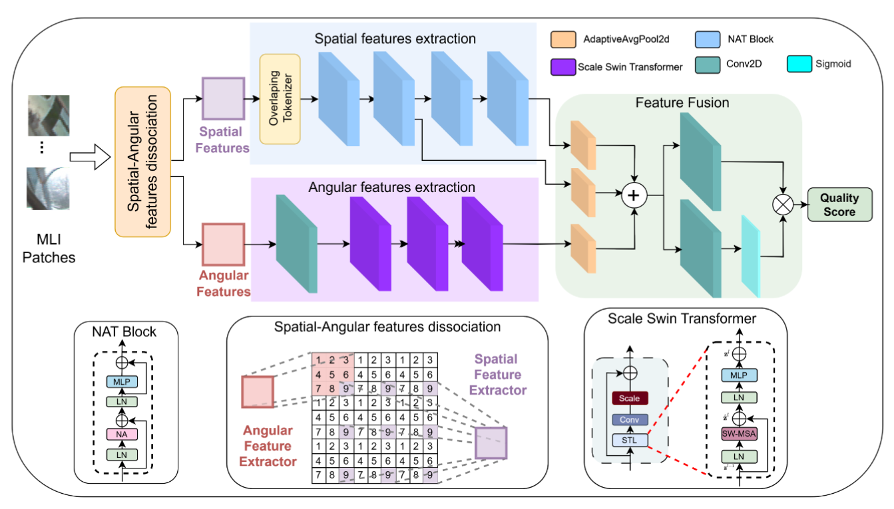

# NASSBLiF

PyTorch code for "NASSBLIF: No-Reference Light Field Image Quality Assessment Via Neighborhood Attention and Scale Swin". The detail description of model and exepriment can be find in our paper: [[Link](https://ieeexplore.ieee.org/document/11084318)]




### Performance of model compared to other state-of-the-art models

| Metric | Time (s) | Parameters (M) | FLOPs (G) |
| :--- | :---: | :---: | :---: |
| DeeBLIF | 0.2237 | 16.65 | 8.04 |
| GeoNRLFIQA | 0.0156 | 126.47 | 58.63 |
| MAFBLiF | 3.1588 | 26.77 | 5.05 |
| PVBLiF | 0.6678 | 2.85 | 3.42 |
| NASSBLiF | 0.0182 | 23.01 | 3.27 |

## Setup

### Requirements
- Python 3.5
- PyTorch (2.5.1)
- natten (0.17.3)

Additional dependencies can be installed from `requirements.txt`:
  
```
pip install -r requirements.txt 
```

For install natten execute:
```
pip3 install natten==0.17.3+torch250cu124 -f https://shi-labs.com/natten/wheels/
```
## Generate Dataset

To generate the dataset for training and testing, use the `generate_data.ipynb` file in the `data/` folder. You will need the following input files:

- Light field images (format details in `generate_data.ipynb` ).
- Ground truth labels for the image quality assessment.

## Training
To train the model, use the train.py script:

```
python train.py
```

You can modify the hyperparameters and dataset in the configuration file `config.py`.


## Citation
If you use this code in your research, please cite our paper:

```
@INPROCEEDINGS{11084318,
  author={Prado, Myllena A. and Farias, Mylène C. Q.},
  booktitle={2025 IEEE International Conference on Image Processing (ICIP)}, 
  title={NASSBLiF: No-Reference Light Field Image Quality Assessment Via Neighborhood Attention and Scale Swin}, 
  year={2025},
  volume={},
  number={},
  pages={659-664},
  keywords={Image quality;Measurement;Attention mechanisms;Computational modeling;Virtual environments;Feature extraction;Transformers;Light fields;User experience;Computational efficiency;Light Field;Image Quality Assessment;Swin Transformer;Neighborhood attention},
  doi={10.1109/ICIP55913.2025.11084318}}

```

## License
This project is licensed under the MIT License - see the LICENSE file for details.


